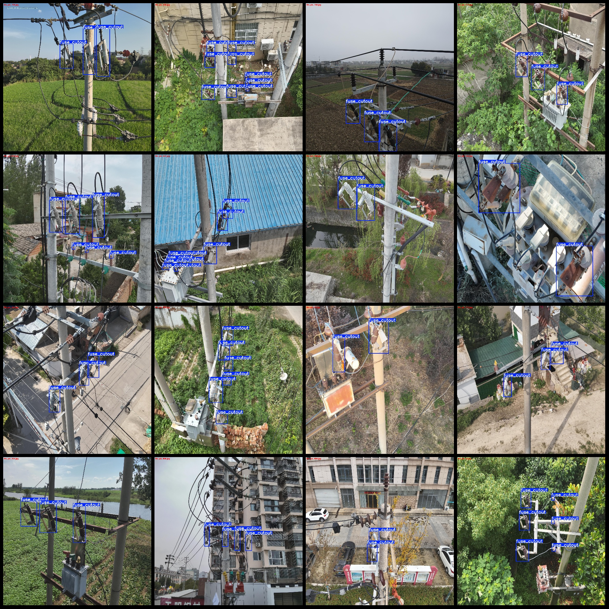
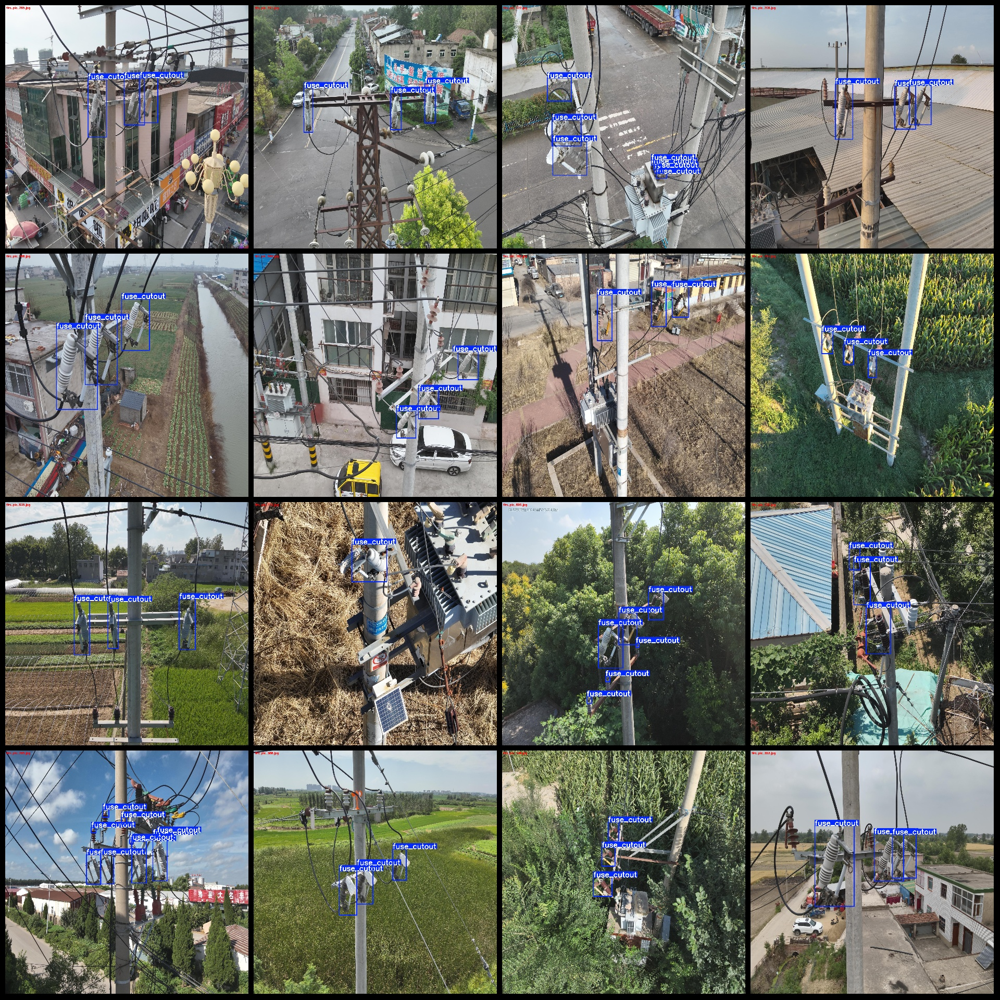
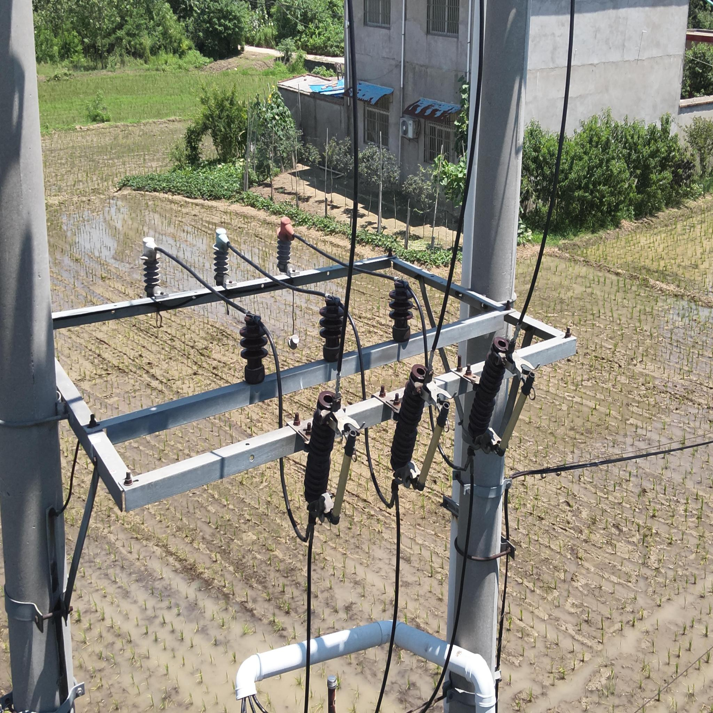

# Outdoor High-Voltage Fuse Dropout Switch Detection Data Set in Power Scenarios with VOC+YOLO Format and 819 Images of 1 Category

The dataset format is Pascal VOC format plus YOLO format (excluding the split path in the txt file, only containing jpg images and corresponding VOC format xml files and YOLO format txt files). The 
number of images (jpg file count): 819.
The number of annotations (xml file count): 819.
The number of annotations (txt file count): 819.
The number of annotation categories: 1.
The category names for annotations: ["fuse_cutout"].
Each category has a box count: 3535.
The total box count: 3535.
Each category occupies an image count: 3535.
Image resolution: 2048x2048.
Using annotation tool: labelImg.
Annotation rules: draw rectangular boxes for each category.
Important note: The dataset does not have divided training, validation, or test sets; you need to divide them yourself.
Special declaration: This dataset does not guarantee the accuracy of the trained models or weight files.
Preview of the images:
Annotation example:

## Images

Here is a pay link on Stripe ( https://buy.stripe.com/3cs8yP7sY87d0vu9AB ). Please contact me lonlonago@foxmail.com after funding $89, and I will send you a complete data files , thank you!

